<p align="center">
  
</p>

<h1 align="center">SPECVORA — Sprint Mobile Development and IoT</h1>

# LINK DO APK
https://mega.nz/file/j41BWQAR#uhXVsxZ_UcRuyzoEleKUTTD_qhOr5dLfLSAnOKIFmno

## Integrantes do grupo

- **Denise Senise** — RM 556006
- **Larissa Rodrigues Lapa** — RM 554517
- **Mateus Leme** — RM 557803
- **David Gabriel Gomes Fernandes** — RM 556020
- **Vinicius Augusto Neves Prestes** — RM 559097

## Desafio escolhido
**Desafio 1 — Inteligência competitiva automotiva**

## Descrição da solução
O **Specvora** é uma aplicação mobile desenvolvida em **React Native com Expo** para apoiar a análise competitiva de veículos.
A solução permite que o usuário pesquise veículos em **um único campo por carro** — pelo nome (ex.: `ranger` traz todas as versões da Ranger) ou por **especificação técnica** (ex.: `1.5`, `diesel 4x4`) —, defina livremente quais **atributos técnicos** deseja consultar e receba uma lista padronizada de especificações técnicas comparáveis. Essa lista é somente um exemplo e utiliza dois JSONs de dados mockados como banco de dados.
Nossa solução tem como base sistemas com o modo paisagem (horizontal) de orientação, preferivel utilizar nessa orientação

## Objetivo
Transformar uma base de dados técnica em uma ferramenta clara para consulta, comparação e validação de especificações automotivas, facilitando o trabalho de analistas internos da Ford.

## Entradas do usuário
- Um campo de pesquisa por veículo a comparar:
  - pelo nome do carro: `ranger` traz todas as versões da Ranger;
  - por especificação técnica/equipamento: `1.5`, `diesel`, `4x4`, `câmera 360`;
  - combinando termos: `diesel 3.0`.
- O veículo já selecionado em um campo não aparece nos resultados do outro.
- Lista livre para selecionar atributos técnicos/equipamentos desejados
  
## Saída da aplicação
- Lista padronizada de especificações técnicas (com 1 ou 2 veículos)
- Campos claros, organizados e comparáveis
- Exibição explícita de informações indisponíveis como `N/A`
- Comparação entre dois veículos
- Gráfico radar como visualização complementar (somente na comparação de 2 veículos)

## 📱 Capturas de tela

O fluxo completo da aplicação, na ordem em que ele é usado:

### 1. Autenticação

| **Login** | **Login com credenciais** |
|:---:|:---:|
| 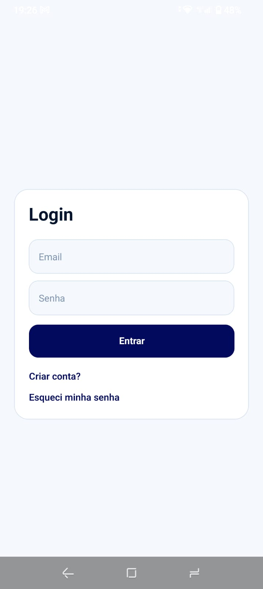 | 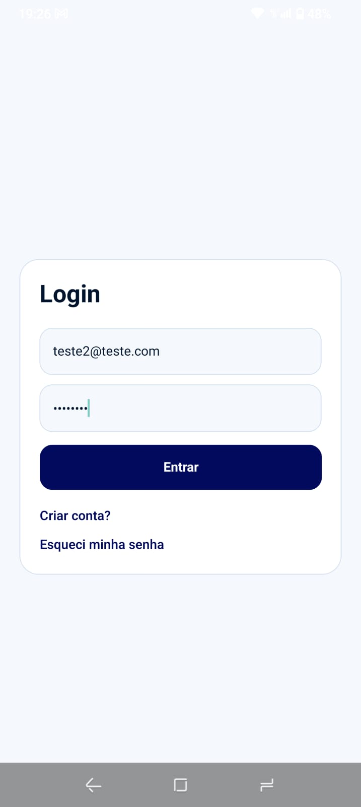 |

### 2. Recuperação de senha

| **Solicitação de recuperação** | **Link enviado** | **E-mail recebido na caixa de entrada** |
|:---:|:---:|:---:|
| 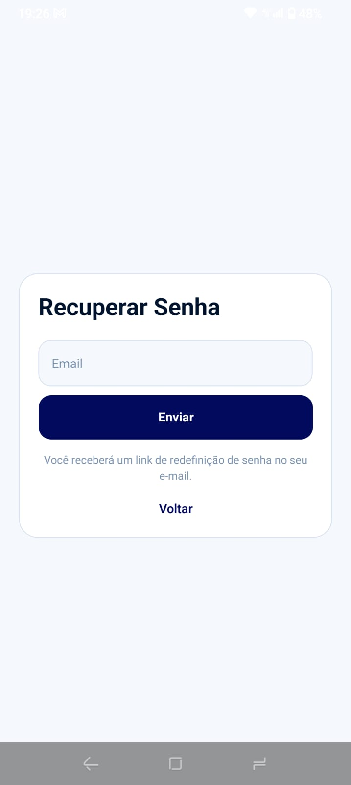 | 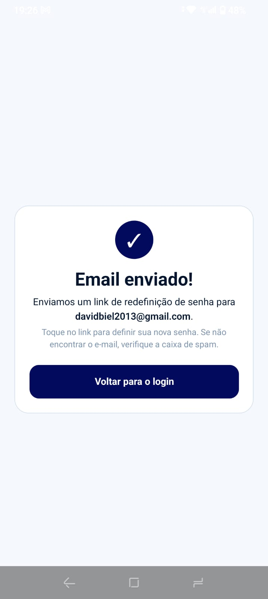 | 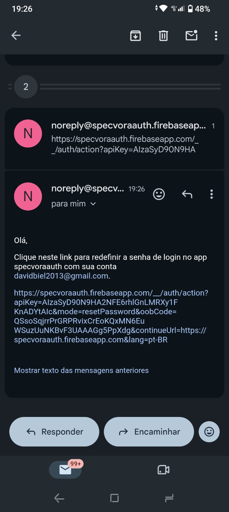 |

### 3. Pesquisa de veículos

| **Tela inicial: um campo por veículo** | **Tela inicial antes da seleção** | **Veículo A selecionado e resultados do veículo B** |
|:---:|:---:|:---:|
| 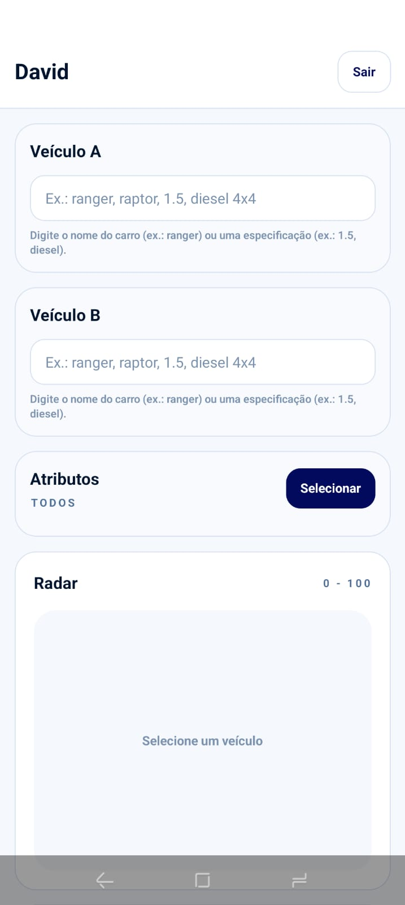 | 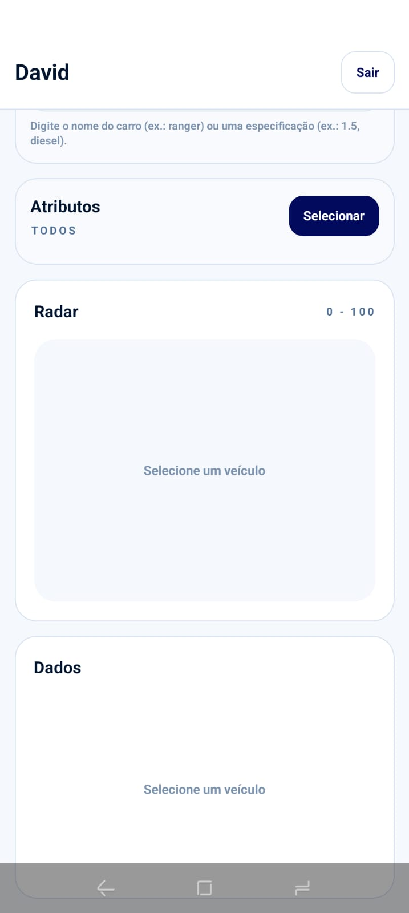 | 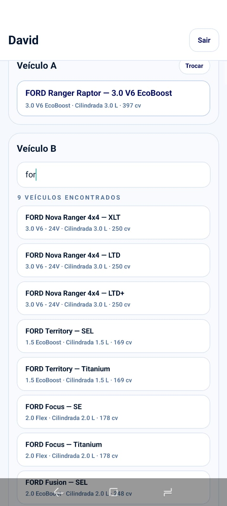 |

### 4. Seleção de atributos técnicos

| **Atributos por categoria** | **Todos os atributos selecionados (283)** | **Filtro de busca dentro dos atributos** |
|:---:|:---:|:---:|
| 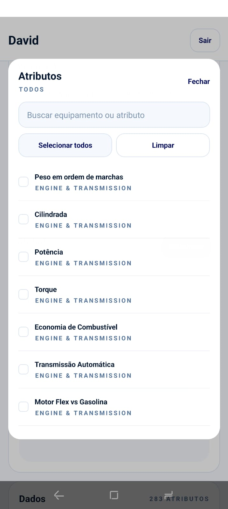 | 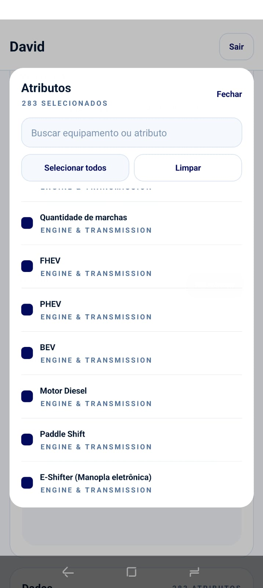 | 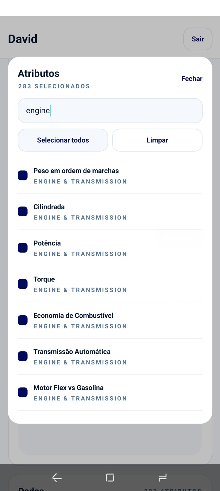 |

### 5. Comparação

| **Tabela padronizada de especificações** | **Gráfico radar (0–100)** | **Detalhe da seção de dados** |
|:---:|:---:|:---:|
| 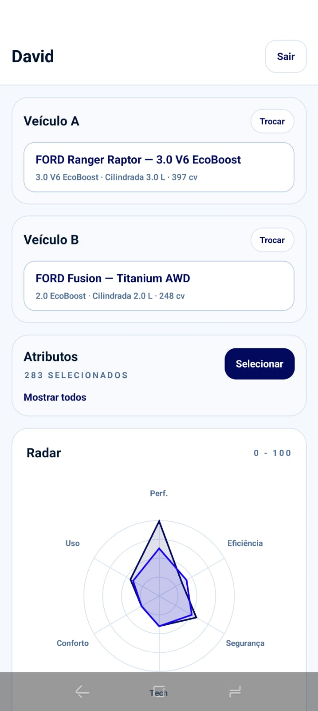 | 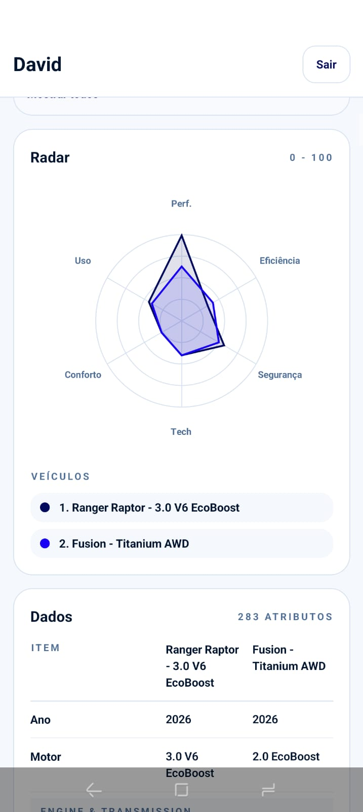 | 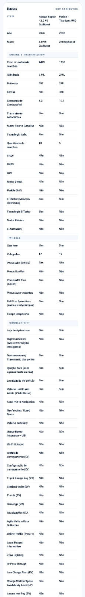 |

## Tecnologias utilizadas
- React Native
- Expo
- Expo Router
- TypeScript
- NativeWind
- Firebase Authentication
- React Native SVG
- Dataset simulado em JSON

## Funcionalidades principais
- Login com Firebase Authentication
- Cadastro de usuário
- Recuperação de senha
- Proteção da tela principal por autenticação
- Pesquisa de veículo por nome ou especificação técnica (um campo por veículo)
- Veículo já selecionado não aparece nos resultados do outro campo
- Seleção livre de atributos técnicos
- Comparação de especificações técnicas em tabela padronizada
- Interface responsiva para celular e tablet

### Pré-requisitos
- Node.js LTS instalado
- Expo CLI (opcional) ou npx
- iOS Simulator/Xcode ou Android Studio/Emulador, ou o aplicativo Expo Go SDK 53 no celular

### Como iniciar
1. Instale as dependências:
```bash
npm install
```
2. Inicie o projeto:
```bash
npm run start
```
3. Escolha a plataforma:
```bash
# no terminal do Expo
i  # iOS
a  # Android
w  # Web (quando aplicável)
```
3. Login Mockado:
Email: test2@test.com
Senha: 12345678

### Scripts úteis
- `npm run start`: inicia o Metro/Expo
- `npm run android`: abre no emulador Android
- `npm run ios`: abre no simulador iOS
- `npm run web`: abre no navegador (quando aplicável)
- `npm run validate`: valida o banco de dados (ids únicos, specs × schema, heranças e os valores do Ranger Raptor usados na validação do desafio) — rode antes de qualquer demo

### Observações sobre o Firebase
- As credenciais em `firebase/config.ts` são do app **web** do projeto `specvoraauth` no Firebase Console (chave de cliente, pública por natureza). Funciona no React Native, mas o ideal para um app dedicado é criar um app **React Native** no console (appId com sufixo `rn:`) e trocar as credenciais.
- A **recuperação de senha** depende de um endereço de email de contato configurado no Firebase Console (Authentication → Settings). Sem ele, o link de recuperação não é entregue.

### Fluxo de recuperação de senha
A recuperação segue a documentação do Firebase Authentication para React Native:

1. `app/forgot-password.tsx` chama `sendPasswordResetEmail` com `ActionCodeSettings` (`handleCodeInApp: true`), enviando o link de recuperação para o e-mail.
2. Ao tocar no link, o app é aberto com o parâmetro `oobCode` na URL (deep link). O `app/_layout.tsx` detecta o código (cold start e app em segundo plano) e encaminha para `app/reset-password.tsx`.
3. A tela de redefinição valida o código com `checkActionCode` (confirmando que é de recuperação de senha) e permite definir a nova senha com `confirmPasswordReset`, tudo dentro do app.
4. Fallback: se o link for aberto fora do app (navegador), a recuperação é concluída na página web do Firebase (`specvoraauth.firebaseapp.com`).

> **Nota:** para o link abrir o app diretamente em builds de produção, é necessário configurar App Links (Android) e/ou Universal Links (iOS) apontando para o domínio usado no e-mail. No Expo Go, o link abre no navegador (fallback web).
